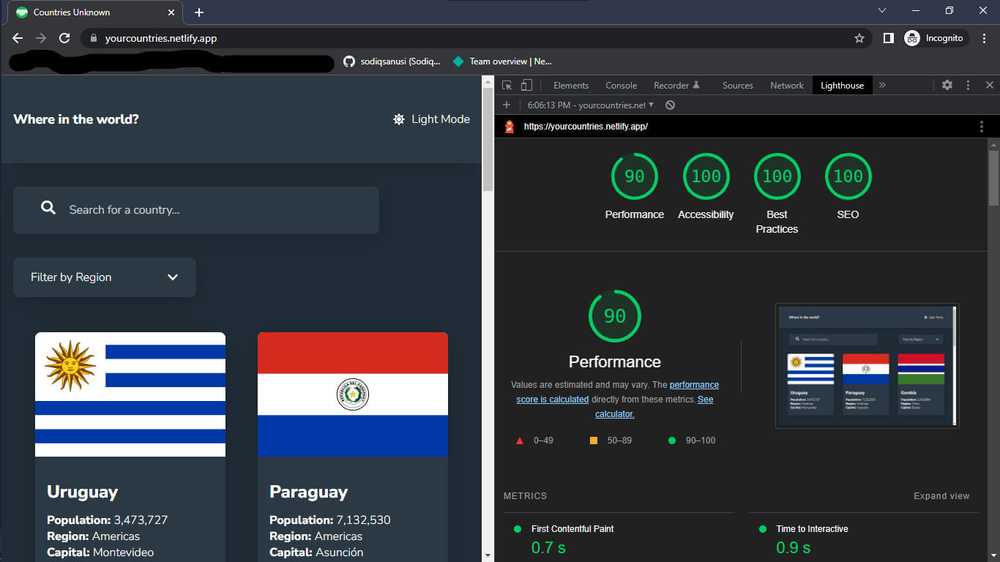

# Countries Unknown

## Table of contents

- [Overview](#overview)
  - [The challenge](#the-challenge)
  - [Screenshot](#screenshot)
  - [Links](#links)
- [My process](#my-process)
  - [Built with](#built-with)
  - [What I learned](#what-i-learned)
  - [Continued development](#continued-development)
  - [Useful resources](#useful-resources)
- [Author](#author)
- [Acknowledgments](#acknowledgments)

## Overview
The goal was to build a web app that allows users to check countries, search, and filter data from a dropdown. Had to integrate a 3rd party RESTful API, then manipulated the data gotten from the APIs endpoints. 

### The challenge
Users should be able to:

- View the optimal layout for the application depending on their device's screen size.
- See all countries from the API on the homepage.
- Search for a country using an `input` field.
- Filter countries by region.
- Click on a country to see more detailed information on a separate page.
- Click through to the border countries on the detail page.
- [x] Toggle the color scheme between light and dark mode _(optional)_ 

### Screenshot

### Links
- Solution URL: [https://github.com/sodiqsanusi/learn-countries/]()
- Live Site URL: [https://yourcountries.netlify.app/]()

## My process
I'm sure you're tired of hearing this😅, buh still I'm saying it. Mobile-first workflow, "Thinking in React" component architecture, and a lot of trial and error. Didn't have access to the design raw files in Figma and Sketch, so had to build based on what I could see in the design images, I tried tho.

### Built with
- Flexbox
- CSS Grid
- Mobile-first workflow
- [React](https://reactjs.org/) - JS library
- [Styled Components](https://styled-components.com/) - For styles
- [React Router v6](https://reactrouter.com/) - For making the react app navigatable.

### What I learned
Due to the amount of images used in the application, I decided to learn more on lazy-loading images for optimization and performance reasons. Also learnt some new CSS tricks also, CSS is so interesting and soo WIDE! 
Learnt on the `Object.keys()` JavaScript method also, this allows you to iterate over the keys of an object and I used this in getting parts of a fetch request I needed to make, didn't know an object was also iterable, JavaScript is nice too.

### Continued development
This may be my last web development project, planning to drop programming so I can focus on my studies. Will drop more updates on that.
If I still continue though, which isn't looking feasible at the moment, I'll love to move on with my skills by learning Next.js. Next is a React framework that'll enable me use Server Side Rendering (SSR) and Static Site Generation (SSG). I pray I actually don't have to drop web dev😭🥺, it has been lovely to me😭😭!

### Useful resources
- [Object.keys() - MDN Docs](https://developer.mozilla.org/en-US/docs/Web/JavaScript/Reference/Global_Objects/Object/keys) - The MDN doc that helped me understand the `Object.keys()` method, check it out.
- [REST countries API](https://restcountries.com/) - I integrated data for the web app UI from this API. The API's response actually has a nice architecture that makes it easy for frontend teams to use and it also has this fantastic filter_Response query that can help specify the data you want per request, helpful for developers that don't know how to use GraphQL. 

## Author
- Twitter - [@sodiqsanusi0](https://www.twitter.com/sodiqsanusi0)

## Acknowledgments
"When there is a good design needed to be converted into code, that's when you'll know the brilliant frontend developers". Hats off to all interface designers working on creating nice designs really. Bigger hats off to the Frontendmentor team for this designs.
